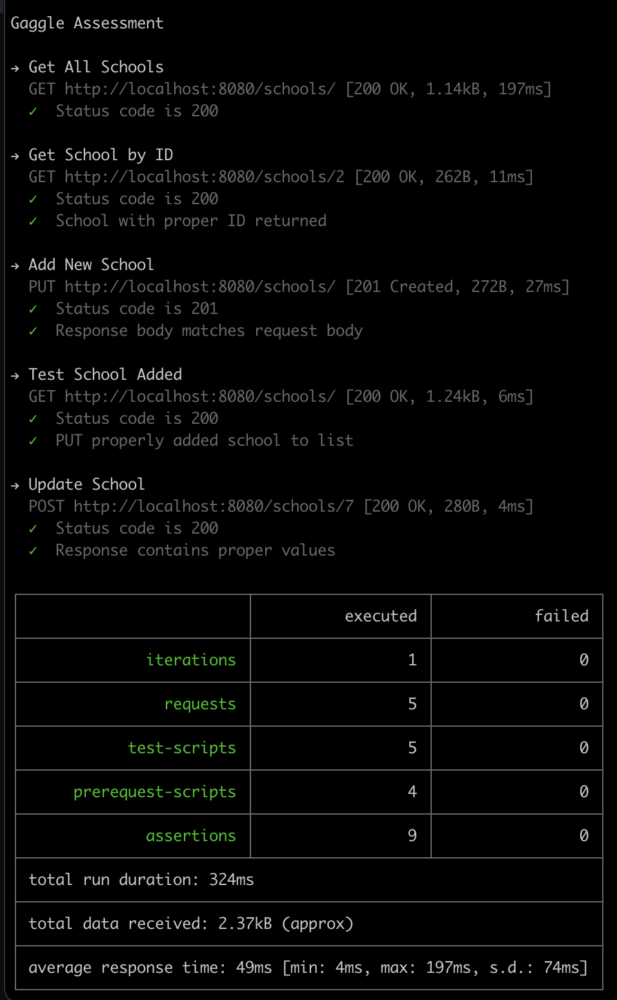

# Gaggle Assessment

## Build & run application locally via Docker

From candidate-technical-assessment-sdet-exercise folder, run via CLI:

`mvn clean package`

`docker build --tag gaggle-image .`

`docker run --publish 8080:8080 gaggle-image`

API will be exposed at port 8080/schools.

## Execute Postman Tests

From candidate-technical-assessment-sdet-exercise folder, run via CLI:

`./node_modules/newman/bin/newman.js run gaggleAssessment.postman_collection.json`

The Postman Newman runner will execute the tests in the declared json file, and the results will be displayed via CLI.

## Github Actions

On any push or pull request made to the Github repo, the action at .github/workflows/action1.yml will run. This will trigger creation of a Docker container which will build the application, execute the tests, then exit.
